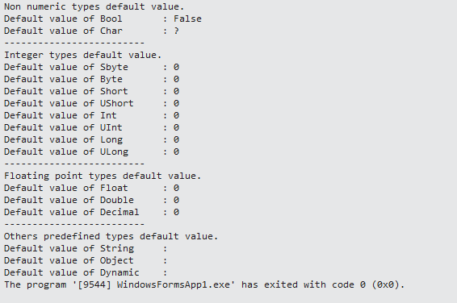
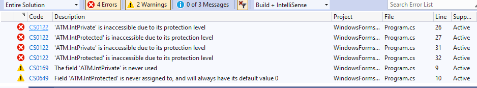

# การทดลอง #

## การทดลอง 9.1  Fields ##

1. ให้พิจารณา code ด้านล่างนี้ นักศึกษาคิดว่าผลการรันจะเป็นอย่างไร 
   
```

  [ให้เขียนความคาดหมายผลที่จะได้ตรงนี้]
   
```   


```csharp
using System;

namespace method_examples
{
    class MyClass
    {
        // Non numeric = 2 types
        public bool myBool;
        public char myChar;

        // Integer = 8 types
        public byte myByte;
        public sbyte mySbyte;
        public short myShort;
        public ushort myUShort ;
        public int myInt;
        public uint myUInt;
        public long myLong;
        public ulong myULong;

        // Floating point = 3 types
        public float myFloat;
        public double myDouble;
        public decimal myDecimal;

        // Others = 3 types
        public string myString;
        public object myObject;
        public dynamic myDynamic;

    }

    class Program
    {
        static void Main()
        {
            MyClass mc = new MyClass();
            Console.WriteLine("Non numeric types default value.");
            Console.WriteLine($"Default value of Bool   \t: {mc.myBool}");
            Console.WriteLine($"Default value of Char   \t: {mc.myChar}");
            Console.WriteLine($"-------------------------");
            Console.WriteLine("Integer types default value.");
            Console.WriteLine($"Default value of Sbyte  \t: {mc.mySbyte}");
            Console.WriteLine($"Default value of Byte   \t: {mc.myByte}");
            Console.WriteLine($"Default value of Short  \t: {mc.myShort}");
            Console.WriteLine($"Default value of UShort \t: {mc.myUShort}");
            Console.WriteLine($"Default value of Int    \t: {mc.myInt}");
            Console.WriteLine($"Default value of UInt   \t: {mc.myUInt}");
            Console.WriteLine($"Default value of Long   \t: {mc.myLong}");
            Console.WriteLine($"Default value of ULong  \t: {mc.myULong}");
            Console.WriteLine($"-------------------------");
            Console.WriteLine("Floating point types default value.");
            Console.WriteLine($"Default value of Float  \t: {mc.myFloat}");
            Console.WriteLine($"Default value of Double \t: {mc.myDouble}");
            Console.WriteLine($"Default value of Decimal\t: {mc.myDecimal}");
            Console.WriteLine($"-------------------------");
            Console.WriteLine("Others predefined types default value.");
            Console.WriteLine($"Default value of String \t: {mc.myString}");
            Console.WriteLine($"Default value of Object \t: {mc.myObject}");
            Console.WriteLine($"Default value of Dynamic\t: {mc.myDynamic}");
        }
    }
}
```

2. สร้าง project แล้วรันโปรแกรม
3. บันทึกผล


   
 


4. ผลที่ได้เหมือนหรือต่างจากที่คิดไว้อย่างไร  
```
ตรงตามที่คิดไว้
   
```   

## การทดลอง 9.2  Access Modifiers ##
1. ให้พิจารณาโปรแกรมต่อไปนี้ นักศึกษาคาดว่าผลการทำงานจะเป็นเช่นไร

```

โปรแกรมจะ Error เนื่องจากการประกาศตัวแปรเป็นแบบ private และ protected จึงไม่สามารถนำตัวแปร 2 ตัวแปรนี้มาเรียกใช้งานใน class Program
  
```   


```cs

using System;

namespace method_examples
{
    class ATM 
    {
        // access modifiers
        public int IntPublic;
        private int IntPrivate;
        protected int IntProtected;
        internal int IntInternal;
        protected internal int IntProtectedInternal;
    }

    class Program
    {
        static void Main()
        {
            ATM atm1;            // สร้าง reference
            atm1 = new ATM();   // สร้าง instance และ assign ให้กับ reference

            // สร้าง instance และ reference พร้อมทั้ง assign ให้แก่ reference
            ATM atm2 = new ATM();

            atm1.IntPublic = 10;
            atm1.IntPrivate = 10;
            atm1.IntProtected = 10;
            atm1.IntInternal = 10;
            atm1.IntProtectedInternal = 10;
            Console.WriteLine($"IntPublic = {atm1.IntPublic}");
            Console.WriteLine($"IntPrivate = {atm1.IntPrivate}");
            Console.WriteLine($"IntProtected = {atm1.IntProtected}");
            Console.WriteLine($"IntInternal = {atm1.IntInternal}");
            Console.WriteLine($"IntProtectedInternal = {atm1.IntProtectedInternal}");


        }
    }
}

```
2. สร้าง project แล้วรันโปรแกรม
3. บันทึกผล


 

 


4. ผลที่ได้เหมือนหรือต่างจากที่คิดไว้อย่างไร  
```

 ไม่ต่างจากที่คิดไว้
   
```   
